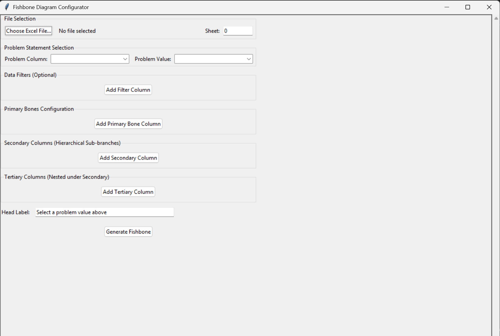
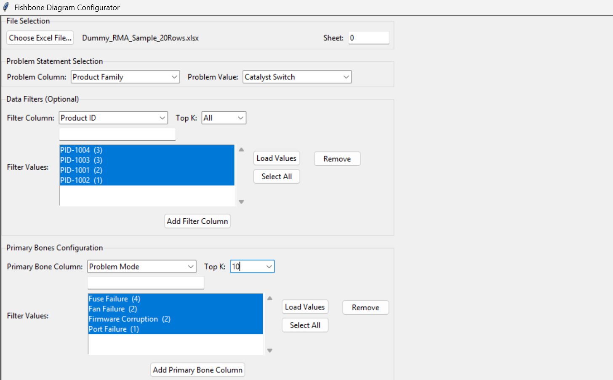
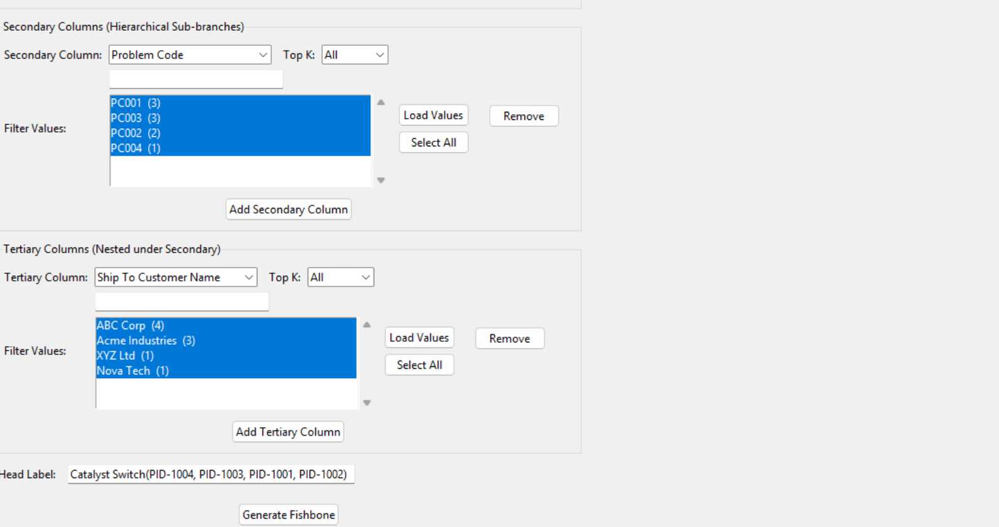
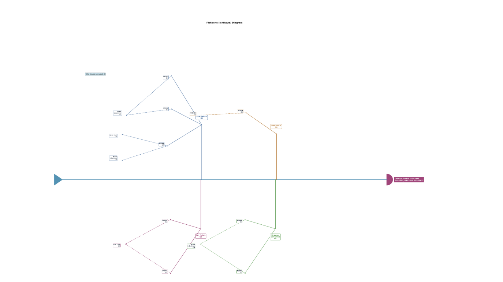
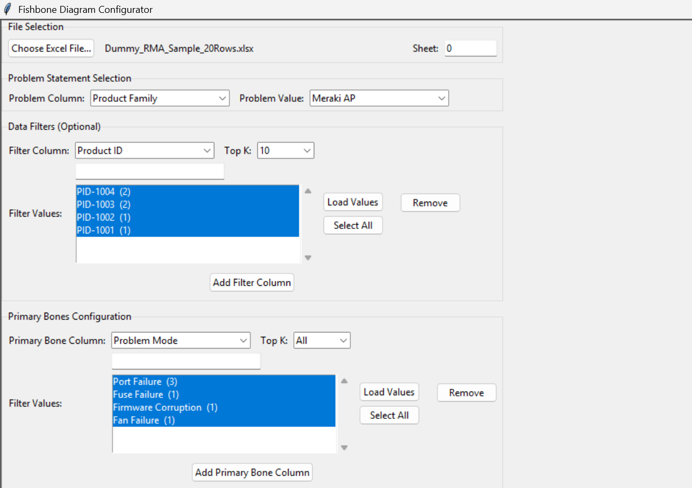
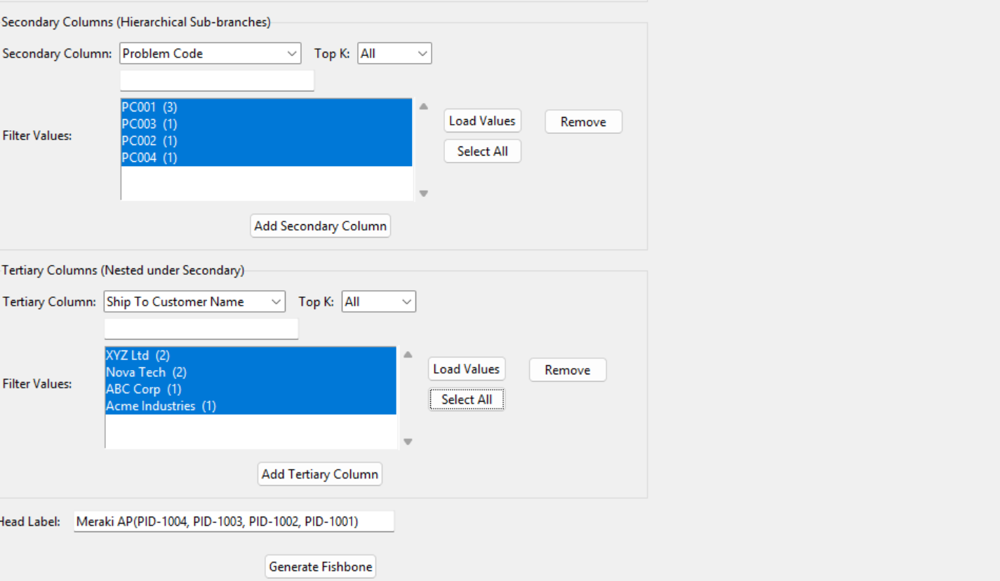
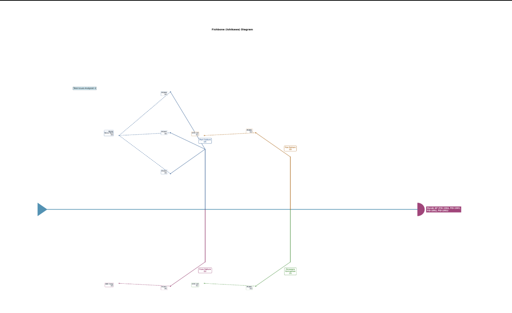

# 🐟 Fishbone Diagram Generator

An interactive desktop application built with **Python**, **Tkinter**, and **Matplotlib** to automate **Fishbone (Ishikawa) Diagram** generation for Root Cause Analysis (RCA).

This project enables users to load an Excel dataset, dynamically configure hierarchical causes, and generate professional Fishbone diagrams through an intuitive graphical interface.

---

## ✨ Features

- 📂 Import Excel datasets
- 🖥️ Interactive Tkinter GUI
- 🔗 Dynamic chained dropdown selections
- 🌳 Primary → Secondary → Tertiary cause hierarchy
- 📊 Automatic Fishbone Diagram generation
- 🎨 Matplotlib visualization
- 🔄 Reusable with different datasets

---

## 🛠️ Tech Stack

- Python
- Tkinter
- Pandas
- Matplotlib
- OpenPyXL

---

## 📁 Repository Structure

```text
Fishbone-Diagram-Generator/
│
├── src/
│   └── fishbone_generator.py
│
├── Dummy_RMA_Sample_20Rows.xlsx
├── requirements.txt
├── LICENSE
├── README.md
└── Project screenshots
```

## 📄 Included Files

- **fishbone_generator.py** – Main application source code.
- **Dummy_RMA_Sample_20Rows.xlsx** – Synthetic dataset for demonstration.
- **requirements.txt** – Python dependencies.
- **LICENSE** – MIT License.
- **README.md** – Project documentation and usage guide.

## 📌 Sample Dataset

A synthetic Excel dataset is included to demonstrate the application's functionality.

> **Note:** The original version of this project was developed using enterprise RMA data. To maintain confidentiality, the dataset included in this repository is completely synthetic and contains no proprietary information.

---
---

# 📸 Application Preview

## 🖥️ Home Screen



---

## 📂 Example 1 – Configuration

### Part 1



### Part 2



### Generated Fishbone Diagram



---

## 📂 Example 2 – Configuration

### Part 1



### Part 2



### Generated Fishbone Diagram



---

# 🚀 How to Run

## 1. Clone the Repository

```bash
git clone https://github.com/Ovisha466/Interactive-Fishbone-Diagram-Generator.git
```

## 2. Navigate to the Project Directory

```bash
cd YOUR_REPOSITORY
```

## 3. Install the Required Dependencies

```bash
pip install -r requirements.txt
```

## 4. Run the Application

```bash
python src/fishbone_generator.py
```

## 5. Load the Sample Dataset

After launching the application:

- Click **Choose Excel File**
- Select **Dummy_RMA_Sample_20Rows.xlsx**
- Configure the desired Problem Statement, Filters, and Bone Hierarchy.
- Click **Generate Fishbone** to visualize the Root Cause Analysis.
